# DreamTrue - Technical Architecture Diagrams

This document provides visual representations of how DreamTrue works, from user interaction to AI processing.

---

## 1. System Overview - High-Level Architecture

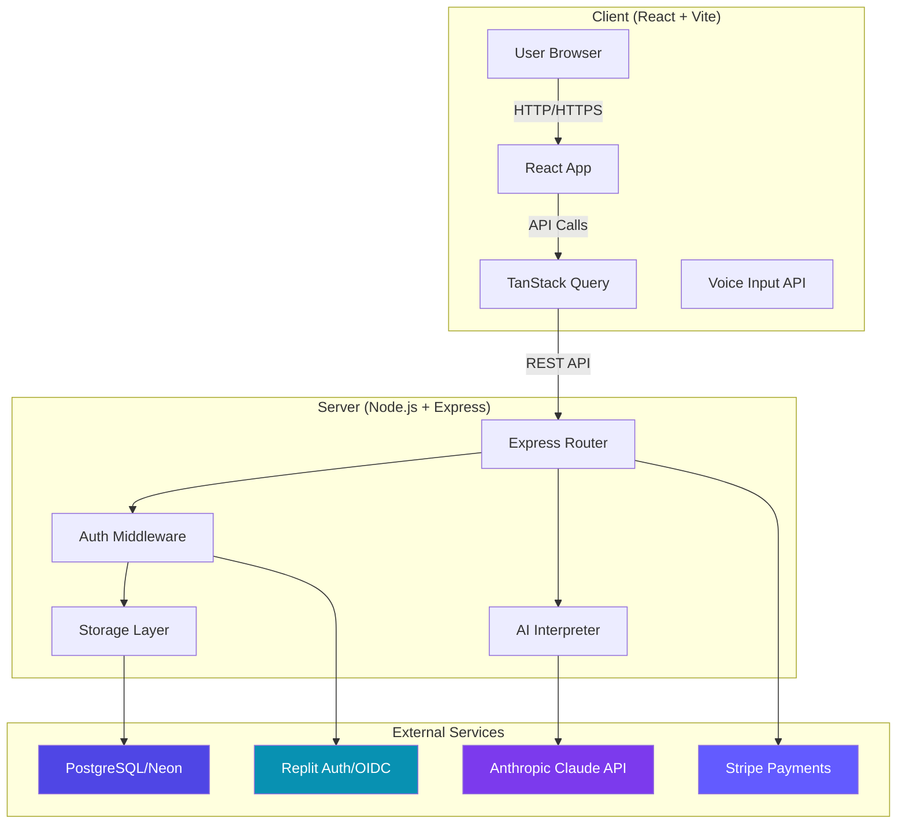

---

## 2. Dream Interpretation Flow (Core Feature)

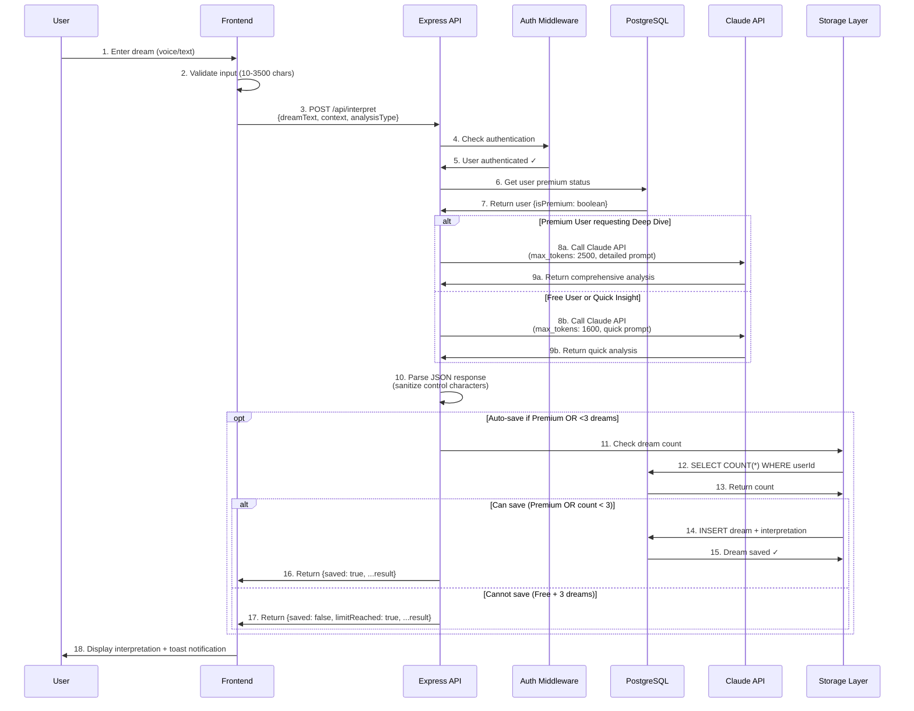

**Key Points:**
- **Input validation:** 10 chars minimum, 3,500 chars maximum
- **Premium gating:** Deep Dive requires `isPremium: true` in database
- **Token budgets:** Quick Insight uses 1,600 tokens, Deep Dive uses 2,500 tokens
- **Auto-save logic:** Free users get 3 dreams max, Premium unlimited
- **Error handling:** JSON sanitization prevents truncation issues

---

## 3. Authentication Flow (Replit Auth OIDC)

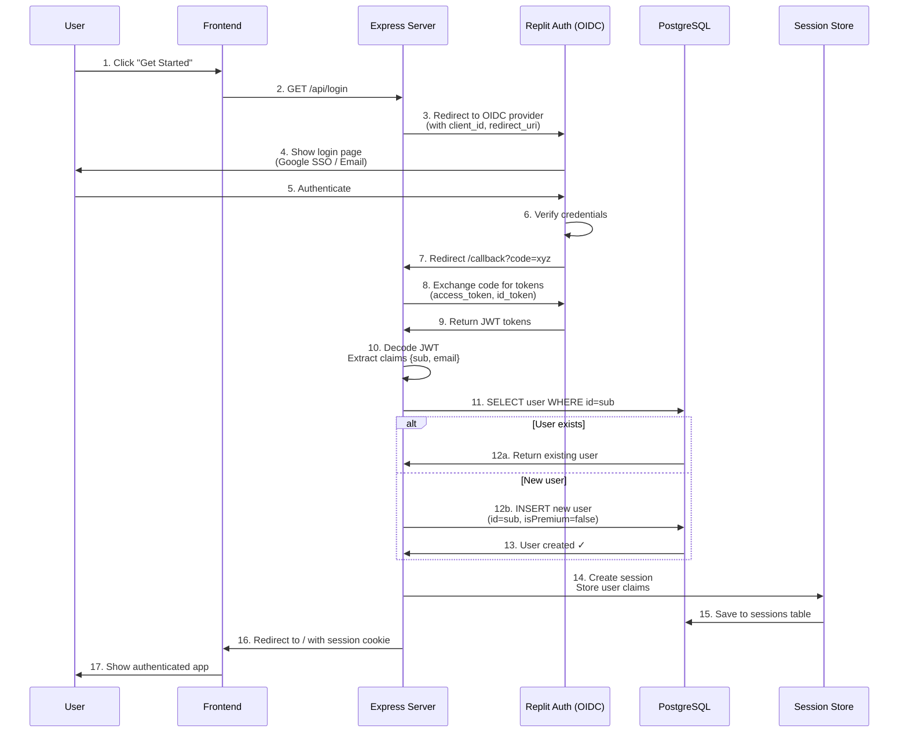

**Key Points:**
- **OIDC Provider:** Replit Auth handles OAuth 2.0 flow
- **Session storage:** PostgreSQL-backed sessions (not in-memory)
- **User creation:** Auto-creates user on first login with `isPremium: false`
- **JWT claims:** `sub` = user ID, `email` = user email

---

## 4. Subscription & Payment Flow (Stripe Integration)

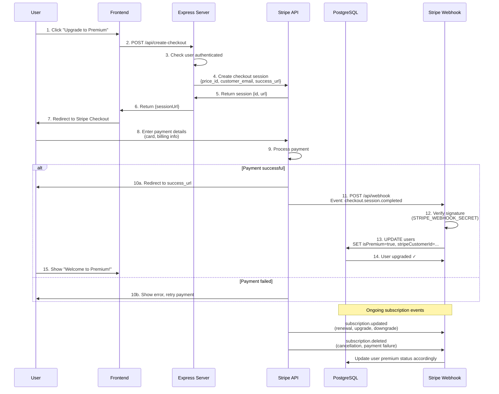

**Key Points:**
- **Stripe Checkout:** Hosted payment page (PCI-compliant)
- **Webhook security:** Signature verification prevents fraud
- **Subscription events:** `created`, `updated`, `deleted` sync database
- **Customer Portal:** Users can manage subscriptions via Stripe

---

## 5. Data Model & Storage Architecture

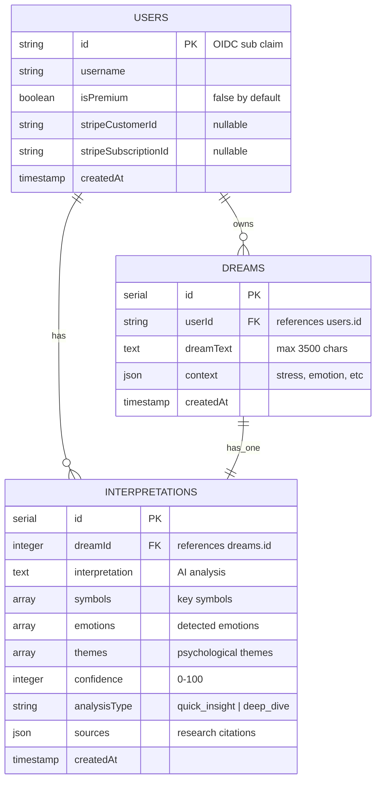

**Storage Interface (IStorage):**
```typescript
interface IStorage {
  // User management
  getUser(userId: string): Promise<User>
  updateUserPremium(userId: string, isPremium: boolean): Promise<void>
  
  // Dream CRUD
  createDream(dream: InsertDream): Promise<Dream>
  getDreams(userId: string): Promise<Dream[]>
  getDream(dreamId: number, userId: string): Promise<Dream>
  deleteDream(dreamId: number, userId: string): Promise<void>
  getDreamCount(userId: string): Promise<number>
  
  // Interpretation storage
  createInterpretation(interp: InsertInterpretation): Promise<Interpretation>
  getInterpretation(dreamId: number): Promise<Interpretation>
}
```

---

## 6. AI Interpretation System (Claude API)

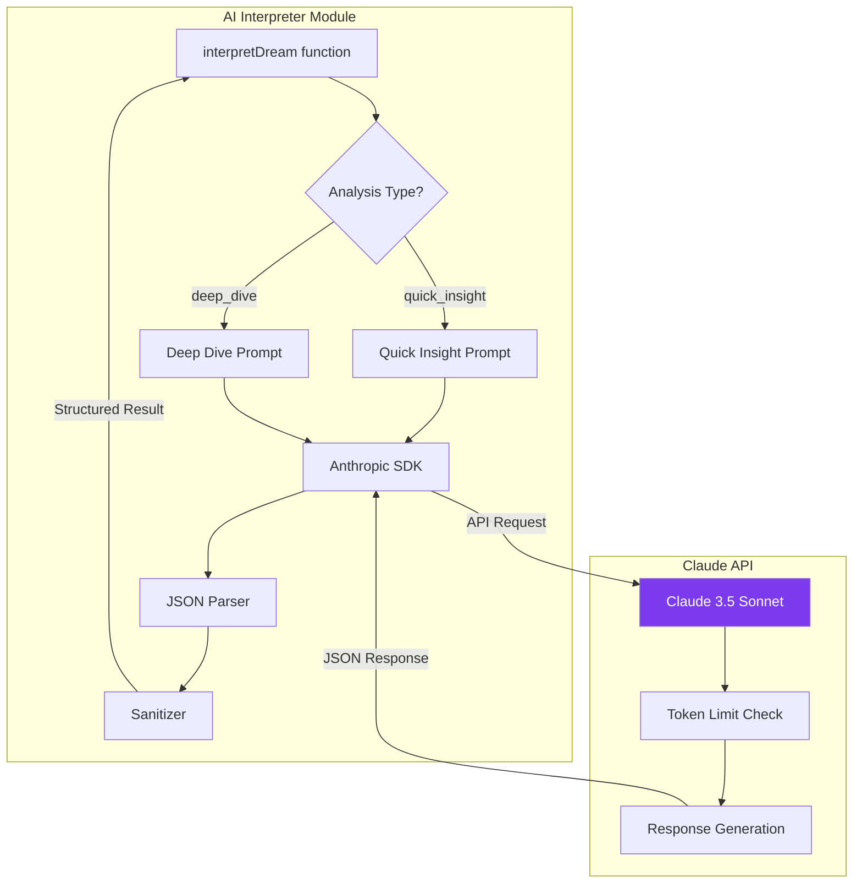

**Prompt Engineering:**

**Quick Insight (Free - 1600 tokens):**
```typescript
const prompt = `You are a dream interpretation AI based on psychology research.

Dream: "${dreamText}"
${context ? `Context: Stress=${context.stress}, Emotion=${context.emotion}` : ''}

Provide a BRIEF interpretation (2-3 sentences) focusing on:
1. Main symbolic meaning
2. Emotional state reflection
3. One actionable insight

Return JSON:
{
  "interpretation": "...",
  "symbols": ["symbol1", "symbol2"],
  "emotions": ["emotion1"],
  "themes": ["theme1"],
  "confidence": 75
}`;
```

**Deep Dive (Premium - 2500 tokens):**
```typescript
const prompt = `You are an expert dream analyst using evidence-based psychology.

Dream: "${dreamText}"
${context ? `Life Context: ${JSON.stringify(context)}` : ''}

Provide COMPREHENSIVE analysis covering:
1. Symbolic Analysis (Jungian archetypes, personal symbols)
2. Emotional Processing (anxiety, desires, fears)
3. Psychological Themes (attachment, autonomy, identity)
4. Cultural Context (if relevant symbols present)
5. Research-Backed Insights (cite 2-3 psychology studies)
6. Actionable Recommendations

Return JSON:
{
  "interpretation": "...", // 300-500 words
  "symbols": ["symbol1", "symbol2", ...],
  "emotions": ["emotion1", "emotion2", ...],
  "themes": ["theme1", "theme2", ...],
  "confidence": 85,
  "sources": [
    {"title": "Study Name", "finding": "Key insight"}
  ]
}`;
```

**Token Budget Breakdown:**

| Component | Quick Insight | Deep Dive |
|-----------|--------------|-----------|
| System prompt | ~300 tokens | ~300 tokens |
| User prompt | ~100 tokens | ~150 tokens |
| Dream text (3500 chars max) | ~875 tokens | ~875 tokens |
| Response buffer | 1,600 tokens | 2,500 tokens |
| **Total** | **~2,875 tokens** | **~3,825 tokens** |
| **Safety margin** | ~325 tokens | ~675 tokens |

---

## 7. Frontend Architecture (React + TanStack Query)

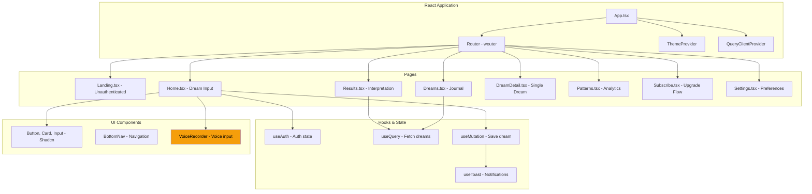

**Key React Patterns:**

1. **Authentication Guard:**
```typescript
// App.tsx
{isLoading || !isAuthenticated ? <Landing /> : <Home />}
```

2. **Data Fetching (TanStack Query):**
```typescript
// Dreams.tsx
const { data: dreams, isLoading } = useQuery({
  queryKey: ['/api/dreams'],
  enabled: !!user
});
```

3. **Mutations with Cache Invalidation:**
```typescript
// Home.tsx
const interpretMutation = useMutation({
  mutationFn: async (data) => apiRequest('/api/interpret', { body: data }),
  onSuccess: () => {
    queryClient.invalidateQueries(['/api/dreams']);
    toast({ title: "Dream Interpreted & Saved!" });
  }
});
```

---

## 8. Freemium Business Logic Flow

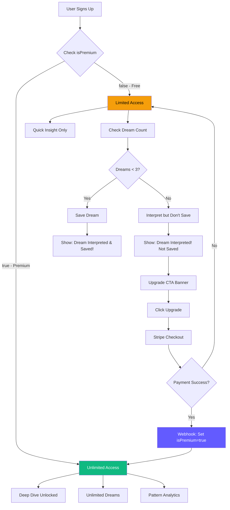

**Conversion Funnel:**
1. **Free Signup** → 100% users
2. **3 Dreams Used** → ~60% of free users
3. **See Upgrade CTA** → ~40% of users
4. **Click Subscribe** → ~10% conversion rate (goal: 3-5%)
5. **Complete Payment** → ~80% checkout completion
6. **Premium User** → **Target: 3-5% of signups**

---

## 9. Deployment Architecture (Replit)

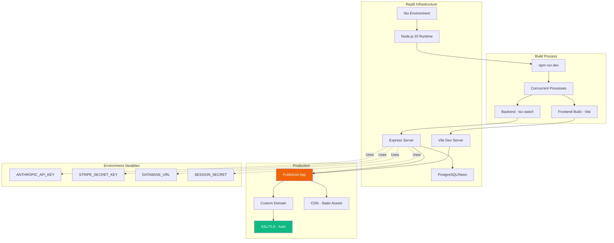

**Deployment Checklist:**
1. ✅ All secrets set in Replit environment
2. ✅ `npm run build` succeeds (TypeScript compiles)
3. ✅ Database migrations applied (`npm run db:push`)
4. ✅ Stripe webhooks point to production URL
5. ✅ SSL/TLS auto-configured by Replit
6. ✅ Custom domain configured (optional)

---

## 10. Security & Privacy Architecture

```mermaid
graph TB
    subgraph "Security Layers"
        A[HTTPS/TLS Encryption]
        B[OIDC Authentication]
        C[Session Management]
        D[API Rate Limiting]
    end
    
    subgraph "Data Protection"
        E[PostgreSQL Encryption at Rest]
        F[No PII in Logs]
        G[Stripe PCI Compliance]
        H[GDPR/CCPA Compliance]
    end
    
    subgraph "Privacy Guarantees"
        I[Dreams Never Sold]
        J[Claude 30-day Retention]
        K[User Data Export]
        L[Right to Deletion]
    end
    
    A --> B
    B --> C
    C --> D
    
    E --> F
    F --> G
    G --> H
    
    I --> J
    J --> K
    K --> L
    
    style H fill:#10B981,color:#fff
    style I fill:#7C3AED,color:#fff
```

**Privacy Flow:**
1. **User creates account** → No PII stored except email (from OIDC)
2. **User enters dream** → Encrypted in transit (HTTPS)
3. **Dream sent to Claude** → 30-day retention, then deleted by Anthropic
4. **Dream stored in DB** → Encrypted at rest by Neon PostgreSQL
5. **User deletes account** → All data purged within 30 days

---

## 11. Performance Optimization Strategy

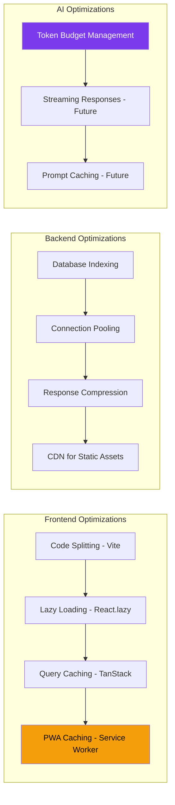

**Performance Targets:**
- **Time to First Byte (TTFB):** < 200ms
- **Page Load Time:** < 2 seconds
- **Quick Insight Response:** 5-15 seconds
- **Deep Dive Response:** 15-30 seconds
- **Dream Journal Load:** < 1 second (cached)

---

## 12. Error Handling & Monitoring

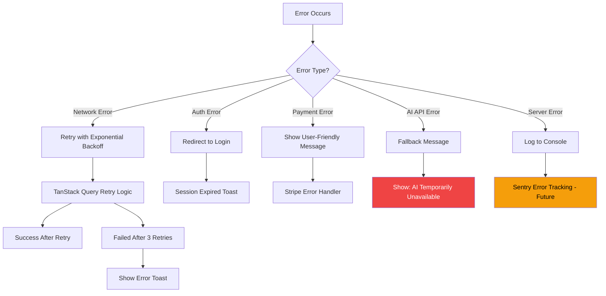

**Error Recovery Strategies:**
1. **Transient errors** → Automatic retry (3 attempts)
2. **Auth errors** → Clear session, redirect to login
3. **Payment errors** → Show Stripe error message
4. **AI errors** → Graceful degradation, user notification
5. **Critical errors** → Log to Sentry, alert developer

---

## Summary: How It All Works Together

**User Journey Flow:**
1. **Discovery** → User finds DreamTrue via Product Hunt/SEO
2. **Signup** → Click "Get Started" → Replit Auth OIDC flow
3. **First Dream** → Voice/text input → Claude Quick Insight → Auto-saved
4. **Habit Building** → 2-3 more dreams → Limit reached
5. **Conversion** → "Upgrade to Premium" → Stripe checkout → Payment
6. **Premium User** → Deep Dive unlocked → Unlimited storage → Pattern tracking

**Tech Stack Summary:**
- **Frontend:** React + TypeScript + Vite + TanStack Query + Shadcn UI
- **Backend:** Node.js + Express + Drizzle ORM
- **Database:** PostgreSQL (Neon serverless)
- **AI:** Anthropic Claude 3.5 Sonnet
- **Auth:** Replit Auth (OIDC/OAuth 2.0)
- **Payments:** Stripe Checkout + Webhooks
- **Hosting:** Replit deployment with auto-SSL

**Data Flow (End-to-End):**
```
User Input → React Form → TanStack Mutation → Express API → 
Auth Middleware → Premium Check → Claude API → JSON Response → 
PostgreSQL Storage → React Query Cache → UI Update
```

**Business Model (Freemium):**
- Free: Quick Insight + 3 dreams → Habit formation
- Premium ($9.95/mo): Deep Dive + Unlimited + Patterns → Retention

---

## Next Steps for Technical Improvements

**Phase 1 (Month 1-3):**
- [ ] Add Sentry for error monitoring
- [ ] Implement rate limiting (prevent abuse)
- [ ] Add email notifications (dream reminders)
- [ ] Optimize database queries (add indexes)

**Phase 2 (Month 4-6):**
- [ ] Implement streaming responses (faster UX)
- [ ] Add pattern detection algorithm
- [ ] Build recommendation engine
- [ ] Add PDF export for dream journal

**Phase 3 (Month 7-12):**
- [ ] Multi-language support (i18n)
- [ ] Mobile native app (React Native)
- [ ] Advanced analytics dashboard
- [ ] Community sharing features

---

**Questions about any part of the architecture?** Let me know which diagram you'd like me to expand or explain in more detail!
